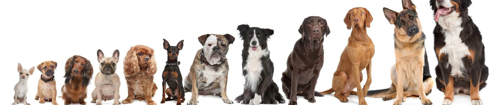

# RESNET Cat vs Dog



数据集来源 Kaggle，验证集来源忘记了，也是 Kaggle 找的

下载链接: https://www.kaggle.com/datasets/shaunthesheep/microsoft-catsvsdogs-dataset


文件描述

- train.ipynb 训练文件，我用 Vast.ai 的4090跑了 100 个 Epoch，主打一个快。

- val.py 验证文件，自行修改目录，我用本地 M1 CPU 运行的，主打一个舒服

## 测试结果

狗
```python
petimages/dog/162.jpg: 猫的概率为 0%; 狗的概率为 100%
petimages/dog/6399.jpg: 猫的概率为 0%; 狗的概率为 100%
petimages/dog/7087.jpg: 猫的概率为 0%; 狗的概率为 100%
petimages/dog/176.jpg: 猫的概率为 0%; 狗的概率为 100%
petimages/dog/7093.jpg: 猫的概率为 0%; 狗的概率为 100%
petimages/dog/5684.jpg: 猫的概率为 0%; 狗的概率为 100%
petimages/dog/2855.jpg: 猫的概率为 0%; 狗的概率为 100%
petimages/dog/3593.jpg: 猫的概率为 0%; 狗的概率为 100%
petimages/dog/9900.jpg: 猫的概率为 1%; 狗的概率为 99%
petimages/dog/88.jpg: 猫的概率为 0%; 狗的概率为 100%
petimages/dog/610.jpg: 猫的概率为 0%; 狗的概率为 100%
petimages/dog/1384.jpg: 猫的概率为 0%; 狗的概率为 100%
petimages/dog/6164.jpg: 猫的概率为 0%; 狗的概率为 100%
petimages/dog/9257.jpg: 猫的概率为 0%; 狗的概率为 100%
petimages/dog/12052.jpg: 猫的概率为 0%; 狗的概率为 100%
petimages/dog/8149.jpg: 猫的概率为 0%; 狗的概率为 100%
petimages/dog/4773.jpg: 猫的概率为 0%; 狗的概率为 100%
petimages/dog/2302.jpg: 猫的概率为 0%; 狗的概率为 100%
petimages/dog/10645.jpg: 猫的概率为 0%; 狗的概率为 100%
petimages/dog/2464.jpg: 猫的概率为 0%; 狗的概率为 100%
petimages/dog/10123.jpg: 猫的概率为 0%; 狗的概率为 100%
petimages/dog/4015.jpg: 猫的概率为 0%; 狗的概率为 100%
petimages/dog/6602.jpg: 猫的概率为 0%; 狗的概率为 100%
petimages/dog/9531.jpg: 猫的概率为 0%; 狗的概率为 100%
petimages/dog/7508.jpg: 猫的概率为 0%; 狗的概率为 100%
petimages/dog/1179.jpg: 猫的概率为 0%; 狗的概率为 100%
petimages/dog/6616.jpg: 猫的概率为 0%; 狗的概率为 100%
petimages/dog/9525.jpg: 猫的概率为 0%; 狗的概率为 100%
```

猫咪
```python
petimages/cat/2114.jpg: 猫的概率为 100%; 狗的概率为 0%
petimages/cat/4565.jpg: 猫的概率为 100%; 狗的概率为 0%
petimages/cat/4203.jpg: 猫的概率为 100%; 狗的概率为 0%
petimages/cat/10335.jpg: 猫的概率为 100%; 狗的概率为 0%
petimages/cat/2672.jpg: 猫的概率为 100%; 狗的概率为 0%
petimages/cat/9727.jpg: 猫的概率为 100%; 狗的概率为 0%
petimages/cat/6414.jpg: 猫的概率为 100%; 狗的概率为 0%
petimages/cat/77.jpg: 猫的概率为 100%; 狗的概率为 0%
petimages/cat/8439.jpg: 猫的概率为 100%; 狗的概率为 0%
petimages/cat/837.jpg: 猫的概率为 100%; 狗的概率为 0%
petimages/cat/2882.jpg: 猫的概率为 100%; 狗的概率为 0%
petimages/cat/3544.jpg: 猫的概率为 100%; 狗的概率为 0%
petimages/cat/11003.jpg: 猫的概率为 100%; 狗的概率为 0%
petimages/cat/5135.jpg: 猫的概率为 100%; 狗的概率为 0%
petimages/cat/1353.jpg: 猫的概率为 100%; 狗的概率为 0%
petimages/cat/7722.jpg: 猫的概率为 100%; 狗的概率为 0%
petimages/cat/8411.jpg: 猫的概率为 100%; 狗的概率为 0%
petimages/cat/7044.jpg: 猫的概率为 100%; 狗的概率为 0%
petimages/cat/8377.jpg: 猫的概率为 100%; 狗的概率为 0%
petimages/cat/1435.jpg: 猫的概率为 100%; 狗的概率为 0%
petimages/cat/9069.jpg: 猫的概率为 100%; 狗的概率为 0%
petimages/cat/5653.jpg: 猫的概率为 100%; 狗的概率为 0%
petimages/cat/3222.jpg: 猫的概率为 100%; 狗的概率为 0%
petimages/cat/11765.jpg: 猫的概率为 100%; 狗的概率为 0%
petimages/cat/5647.jpg: 猫的概率为 100%; 狗的概率为 0%
petimages/cat/2128.jpg: 猫的概率为 100%; 狗的概率为 0%
petimages/cat/3236.jpg: 猫的概率为 100%; 狗的概率为 0%
petimages/cat/11771.jpg: 猫的概率为 100%; 狗的概率为 0%
petimages/cat/4559.jpg: 猫的概率为 100%; 狗的概率为 0%
petimages/cat/7050.jpg: 猫的概率为 100%; 狗的概率为 0%
petimages/cat/8363.jpg: 猫的概率为 100%; 狗的概率为 0%
petimages/cat/12278.jpg: 猫的概率为 100%; 狗的概率为 0%
petimages/cat/1421.jpg: 猫的概率为 100%; 狗的概率为 0%
```